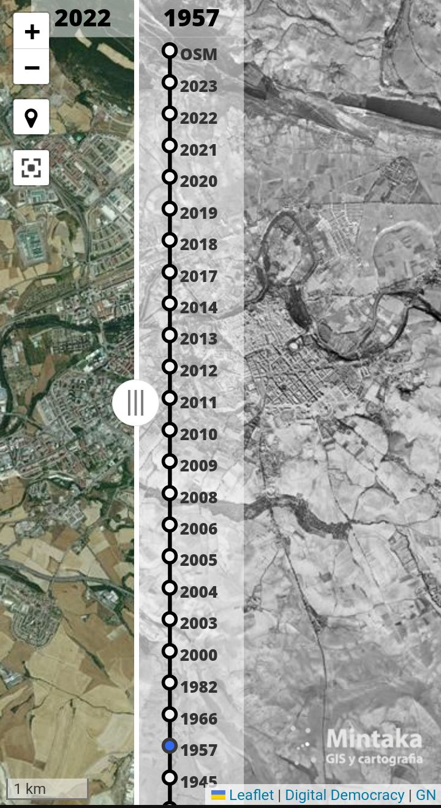

# WMS-SideBySide
WMS-SideBySide-Leaflet. Allow all layers each side.

This is an app to compare map service historic images in wmts or wms formats. 
The plugin https://lab.digital-democracy.org/code/leaflet-side-by-side/ on leaflet7.7.1 is used. 
The Digital Democracy plugin doesn't work in newer Leaflet versions. 
The Digital Democracy plugin don't allow place the same layer in both sides hence you can't compare all images you have. 
The code in this app allow compare all imagery loading the services each time the service imagery is changed.  
This way you can compare all images. 
Viewer in :
https://napargis.com/

